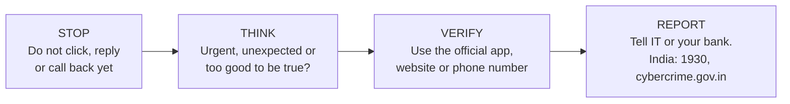

# CodeAlpha_PhishingAwareness

A **phishing awareness training module**: an 18-slide presentation with an interactive quiz, plus complete written documentation of the training content.
Built for the **CodeAlpha Cyber Security Internship, Task 2: Phishing Awareness Training**.

**Goal:** teach non-technical people how to **recognise, avoid and report** phishing, using real-world examples and a short quiz to make it stick.

---

## How this project meets the task requirements

| Task requirement | Where it is covered |
|------------------|--------------------|
| Create a presentation or online module on phishing | 18-slide deck (`presentation/`) and the full written module ([docs/TRAINING_MODULE.md](docs/TRAINING_MODULE.md)) |
| Explain how to recognise phishing **emails** and **fake websites** | Module 3 (annotated example email, five red flags) and Module 4 (three look-alike address tricks, how to read a web address) |
| Educate about **social engineering** tactics | Module 5: urgency, authority, fear, greed and familiarity, with example lines and defences |
| Provide **best practices and tips** | Module 8 (six habits), Module 9 (what to do after a click), and a one-page [cheat sheet](docs/CHEAT_SHEET.md) |
| Include **real-world examples** and **interactive quizzes** | Module 6 (three real cases), Module 7 (scams common in India), a 5-question quiz in the deck (answers appear on click) and a 10-question [self-check](docs/QUIZ.md) |

## What is in this repository

```
CodeAlpha_PhishingAwareness/
├── README.md                    # this file
├── docs/
│   ├── TRAINING_MODULE.md       # the full training content, module by module, with presenter notes
│   ├── QUIZ.md                  # 10 questions with answers and explanations
│   └── CHEAT_SHEET.md           # one-page summary to print or share
├── presentation/
│   └── README.md                # slide index, and where to place the exported PDF/PPTX
└── LICENSE
```

## The training at a glance

| # | Module | Slides | What the learner gets |
|---|--------|--------|-----------------------|
| 1 | Why phishing matters | 2 | Three key numbers: share of breaches, speed of clicking, growth of incidents in India |
| 2 | What phishing is | 3-4 | The four-step attack (bait, hook, catch, misuse) and six types: email, spear, smishing, vishing, quishing, BEC |
| 3 | Spotting a phishing email | 5 | An annotated example with five red flags |
| 4 | Fake websites | 6 | How to read an address, and why the padlock proves nothing |
| 5 | Social engineering | 7 | The five emotional triggers attackers use |
| 6 | Real-world cases | 8 | Fake invoices, phone phishing, MFA fatigue |
| 7 | Phishing in India | 9 | KYC/PAN texts, UPI collect requests, courier and bill alerts, "digital arrest" calls |
| 8 | Protecting yourself | 10 | Six habits |
| 9 | If you clicked | 11 | A five-step response plan |
| 10 | Quiz | 12-16 | Five scenario questions |
| 11 | Takeaways and sources | 17-18 | Stop, Think, Verify, Report; sources and help contacts |

Total presenting time is about **20 to 25 minutes**, plus questions.

## Audience

Employees, students and family members with no security background. No technical knowledge is assumed. The India-specific module can be swapped out for a different region.

## How to use it

1. **Present the deck.** Open the slides in presentation mode. Each slide has speaker notes; the quiz answers appear on click.
2. **Read the module.** [docs/TRAINING_MODULE.md](docs/TRAINING_MODULE.md) contains everything on the slides plus fuller explanations, so the training can also be read on its own or delivered without slides.
3. **Test yourself.** [docs/QUIZ.md](docs/QUIZ.md) has 10 questions (the 5 from the deck plus 5 extra) with explanations.
4. **Share the cheat sheet.** [docs/CHEAT_SHEET.md](docs/CHEAT_SHEET.md) fits on one page.

## The core message



## A note on the examples

Every brand, address and message in the slides is **fictional**. Example web addresses use the reserved `.example` domain, which can never belong to a real organisation. No real person's or company's branding is imitated.

## Sources

Statistics and cases are summarised from public sources, listed in [docs/TRAINING_MODULE.md](docs/TRAINING_MODULE.md#sources). Figures change from year to year: check the original source before quoting a number in your own material.

## Author and licence

Prepared by Prateek as part of the CodeAlpha Cyber Security Internship. Released under the [MIT License](LICENSE).
