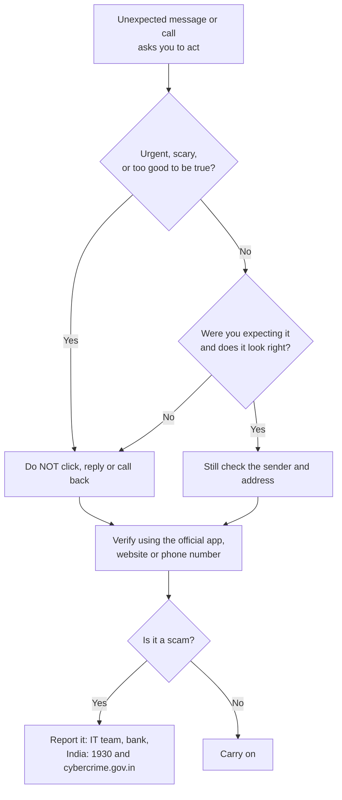

# Phishing Cheat Sheet

## STOP. THINK. VERIFY. REPORT.

## 7 red flags

| # | Red flag | Example |
|---|----------|---------|
| 1 | Urgency or threats | "Blocked in 2 hours" |
| 2 | Look-alike sender or address | `examp1ebank.example` |
| 3 | Generic greeting | "Dear Customer" |
| 4 | Link that does not match the text | Hover to check |
| 5 | Unexpected attachment | ZIP, EXE, unexpected invoice |
| 6 | Request for password, OTP, PIN or payment | "Read me the code" |
| 7 | Too good to be true | Prizes, refunds |

## Reading a web address

The real owner is the part **before the first single slash**, read **right to left**.

`https://examplebank.example.`**`verify-now.example`**`/login` -> the owner is `verify-now.example`

A padlock means the connection is **encrypted**, not that the site is **honest**.

## Never share

- Your OTP, PIN, password or CVV, with anyone, for any reason
- A prompt approval you did not start
- Remote-access codes for "support" you did not ask for

You never need a PIN to **receive** money.

## If you clicked or shared something

1. **Disconnect** the device if you opened a file or installed something
2. **Change passwords** from a clean device (email and banking first)
3. **Call your bank** to block cards and stop payments
4. **Report it** to your IT team, and to the authorities
5. **Watch your accounts** for the next few weeks

## India: who to contact

| Need | Contact |
|------|---------|
| Money lost to online fraud | **1930** (National Cyber Crime Helpline), call immediately |
| Report cyber crime online | **cybercrime.gov.in** |
| Organisations reporting incidents | CERT-In, cert-in.org.in |
