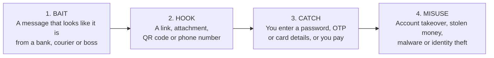

# Phishing Awareness Training: Full Module

**Duration:** about 20 to 25 minutes
**Audience:** non-technical staff, students, family members
**Format:** presentation (18 slides) with speaker notes, or read on its own
**Slides referenced as:** S1 to S18

---

## Contents

1. [Learning objectives](#learning-objectives)
2. [Agenda](#agenda)
3. [Module 1: Why phishing matters](#module-1-why-phishing-matters)
4. [Module 2: What phishing is](#module-2-what-phishing-is)
5. [Module 3: Spotting a phishing email](#module-3-spotting-a-phishing-email)
6. [Module 4: Fake websites](#module-4-fake-websites)
7. [Module 5: Social engineering](#module-5-social-engineering)
8. [Module 6: Real-world cases](#module-6-real-world-cases)
9. [Module 7: Phishing in India](#module-7-phishing-in-india)
10. [Module 8: Protecting yourself](#module-8-protecting-yourself)
11. [Module 9: If you clicked](#module-9-if-you-clicked)
12. [Module 10: Quiz](#module-10-quiz)
13. [Module 11: Key takeaways](#module-11-key-takeaways)
14. [Slide index](#slide-index)
15. [Sources](#sources)

---

## Learning objectives

By the end of the session, a learner can:

1. Explain what phishing is and name its main forms (email, spear phishing, SMS, voice, QR code, business email compromise).
2. Spot at least five warning signs in a suspicious email.
3. Read a web address correctly and tell a real site from a look-alike.
4. Recognise the five emotional triggers used in social engineering.
5. Apply the habit **Stop, Think, Verify, Report** to any unexpected request.
6. Describe what to do in the first hour after clicking a bad link or sharing details.

## Agenda

| Time | Module | Slides |
|------|--------|--------|
| 0:00 | Introduction and why it matters | S1-S2 |
| 0:03 | What phishing is, and its types | S3-S4 |
| 0:06 | Spotting emails and fake websites | S5-S6 |
| 0:11 | Social engineering | S7 |
| 0:13 | Real-world cases and India | S8-S9 |
| 0:17 | Protecting yourself and responding | S10-S11 |
| 0:20 | Quiz | S12-S16 |
| 0:24 | Takeaways and questions | S17-S18 |

---

## Module 1: Why phishing matters

*Slide S2*

| Figure | Source |
|--------|--------|
| **36%** of data breaches involve phishing | Verizon Data Breach Investigations Report 2025, as summarised by StationX |
| **21 seconds** is the median time for a person to click a phishing link | Verizon Data Breach Investigations Report 2025, as summarised by StationX |
| Reported cyber-security incidents in India rose from **10.29 lakh (2022)** to **22.68 lakh (2024)**, about **2.2 times** | Press Information Bureau, Government of India |

> The India figure counts **all** reported cyber-security incidents, not only phishing. It shows the overall growth of online threats.

**Key idea:** attackers go after people first, because people are easier to trick than systems. A firewall cannot stop someone from typing their password into a fake page.

**Presenter notes:** three numbers set the scene. About a third of breaches involve phishing, people click within seconds, and reported incidents in India have roughly doubled in two years.

---

## Module 2: What phishing is

*Slides S3 and S4*

**Definition.** Phishing is a **social-engineering attack**. The attacker pretends to be someone you trust to trick you into giving away information, money or access.

### The four steps of an attack



*Fun fact: the "ph" in phishing comes from "phreaking", early hacker slang for phone hacking.*

### Types of phishing

| Type | Channel | How it works | Example |
|------|---------|--------------|---------|
| **Email phishing** | Email | Mass emails posing as a bank, courier or online service | "Your account has been locked" |
| **Spear phishing** | Email, targeted | Built for one person using details found about them | A message that mentions your real manager and project |
| **Smishing** | SMS | Fake texts with a link | KYC update, parcel held, prize won |
| **Vishing** | Phone call | Callers pretending to be your bank, police or tech support | "Your account is compromised, read me the OTP" |
| **Quishing** | QR code | A QR code that opens a fake login or payment page | A sticker pasted over a real QR code |
| **BEC** | Email, money | Business email compromise: a fake boss or vendor demands urgent payment | "Change the supplier's bank details today" |

**Presenter notes:** same idea, different channel. Walk through the four steps with one example, such as a fake bank SMS. The attack depends on you, not on breaking any technology.

---

## Module 3: Spotting a phishing email

*Slide S5*

The slide shows a made-up email from a fictional bank. Five features give it away.

```
From:     Example Bank Support <alerts@examplebank-kyc.example>      <- (1)
Subject:  URGENT: Your account will be blocked in 2 hours!           <- (2)

Dear Customer,                                                       <- (3)
Your KYC has expired. Update now or your account will be
closed permanently.

[ Verify my account ]  -> http://examplebank.verify-now.example/login  <- (4)

Attachment: KYC_Form.zip                                             <- (5)
```

| # | Red flag | What to check | Why it matters |
|---|----------|---------------|----------------|
| 1 | **Sender domain** | Compare the address with the bank's real website | Attackers register look-alike domains that are close but not the same |
| 2 | **Urgency and threats** | Real banks do not threaten closure within hours | Pressure stops you from thinking |
| 3 | **Generic greeting** | "Dear Customer" instead of your name | Mass emails do not know who you are |
| 4 | **Link mismatch** | Hover (do not click) to see the real address | The button text and the real destination differ |
| 5 | **Odd attachment** | Never open ZIP or EXE files you did not expect | They can carry malware |

None of these flags proves fraud on its own. Together they are a strong signal.

### Extra checks for emails

- **Reply-To address:** the "From" name may look right while replies go somewhere else.
- **Spelling and tone:** odd grammar, or a message that does not sound like the sender.
- **Unexpected requests:** a password, OTP, gift cards or a payment change.
- **Email headers:** most mail apps have a "Show original" or "View source" option that reveals the real sending server and whether the email passed SPF, DKIM and DMARC, the checks that confirm a message really came from the domain it claims.

**The safest habit:** do not use anything in the message. Open the bank's official app, or type its address yourself.

---

## Module 4: Fake websites

*Slide S6*

### How to read a web address

The real owner of a site is the part **before the first single slash**, read **from right to left**.

```
https://examplebank.example.verify-now.example/login
                            ^^^^^^^^^^^^^^^^^^^
                            The real owner is verify-now.example
```

### Three common tricks

| Trick | Example (fictional) | What gives it away |
|-------|---------------------|--------------------|
| **Look-alike spelling** | `examp1ebank.example` | The letter l is replaced by the digit 1 |
| **Real name as a subdomain** | `examplebank.example.verify-now.example` | The part that matters is the end: `verify-now.example` |
| **Extra words** | `examplebank-secure-kyc.example` | Banks rarely add words like "secure" or "kyc" to their domain |

### The padlock myth

> A padlock only means the connection is **encrypted**. It does not mean the site is honest.

Attackers also use HTTPS and padlocks. Check **who** you are connected to, not just whether the connection is encrypted.

### Good habits

- Type the address yourself, or use a bookmark, for banks and shopping sites.
- Be careful with shortened links and QR codes: preview where they go.
- Let a **password manager** fill in passwords. It matches the real domain, so it will not fill in a fake one, which is a useful warning sign.
- Be suspicious of any login page you reached from a message.

**Presenter notes:** the highlighted part in each address is the real owner. Teach the rule (before the first single slash, right to left). Point out that padlocks prove nothing about honesty.

---

## Module 5: Social engineering

*Slide S7*

Technology is rarely the target. **Emotions are.** Attackers push five buttons:

| Trigger | Example line | Defence |
|---------|--------------|---------|
| **Urgency** | "Your account will be blocked in 2 hours." | Slow down. Real problems survive a few minutes of checking |
| **Authority** | "This is the police, your bank, or your manager." | Verify the person through an official channel |
| **Fear** | "Your SIM will be cut off and a case will be filed." | Fear is the point: hang up and call the official number |
| **Greed** | "You won a prize. Claim your refund now." | If it is too good to be true, it is |
| **Familiarity** | "Hi, it's me. Can you check this file?" | Confirm with the person by another method |

**The common thread:** they want you to act **before you think**.

**Presenter notes:** ask the audience which of these they have already seen in a text or call.

---

## Module 6: Real-world cases

*Slide S8*

| Year | Case | What happened | Lesson |
|------|------|---------------|--------|
| 2013-2015 | **Google and Facebook invoice scam** | A fake supplier sent realistic invoices. Over $100 million was paid before it was caught | Confirm payment changes by calling a known number |
| 2020 | **Twitter account takeover** | Attackers phoned staff posing as IT support, reached internal tools and hijacked famous accounts for a Bitcoin scam | Verify any caller before sharing access |
| 2022 | **Uber network breach** | An attacker kept sending login approval prompts, then messaged the employee as IT support until one was approved | Never approve a prompt you did not start (MFA fatigue) |

Three different tricks (a fake invoice, a phone call, approval spam). None needed advanced hacking, only a convincing story.

> These summaries come from public reporting. Check the original sources before quoting exact figures.

---

## Module 7: Phishing in India

*Slide S9*

| Scam | How it works | Reality check |
|------|--------------|---------------|
| **Fake KYC and PAN texts** | An SMS says your account will be blocked unless you update details through a link | Do not use the link. Check with your bank's official app, website or branch instead |
| **UPI collect requests** | You are asked to enter your PIN to "receive" money | **You never need a PIN to receive money** |
| **Fake courier or bill alerts** | Messages about a held parcel or an electricity cut-off, with a payment link | Check on the official app or website instead |
| **"Digital arrest" calls** | Callers posing as police or customs claim you are under arrest and demand money | Real agencies do not demand money over a call or video call |

### If money is lost

| Step | Action |
|------|--------|
| 1 | **Call 1930**, the national helpline for financial cyber fraud, immediately. Speed matters |
| 2 | Report at **cybercrime.gov.in**, the National Cyber Crime Reporting Portal |
| 3 | Inform your bank and ask it to block cards or stop payments |

Government agencies involved in handling cyber incidents include I4C (Indian Cybercrime Coordination Centre) and CERT-In.

---

## Module 8: Protecting yourself

*Slide S10*

| Habit | What to do |
|-------|-----------|
| **1. Pause** | Urgency is the attacker's tool. Take a minute before you act |
| **2. Check the source** | Hover over links, read the full address, confirm the sender |
| **3. Turn on MFA** | A second step can stop an attacker who has your password |
| **4. Use unique passwords** | Use a password manager and never reuse a password |
| **5. Verify another way** | Open the official app or call the official number yourself |
| **6. Report it** | Tell your IT team or bank, so others are warned too |

If you remember only one, make it the fifth: **verify through a channel the attacker does not control.**

### MFA tips
- Prefer an authenticator app or security key over SMS codes where possible.
- **Never approve a prompt you did not start**, and never read out a one-time code to anyone.

---

## Module 9: If you clicked

*Slide S11*

Everyone gets caught eventually. What matters is **speed and honesty**. Do not be embarrassed: attackers count on that silence.

| Step | Action |
|------|--------|
| **1. Disconnect** | Turn off Wi-Fi or mobile data if you opened a file or installed something |
| **2. Change passwords** | Use a clean device. Start with email and banking |
| **3. Call your bank** | Block cards and stop payments. In India, call 1930 right away if money is lost |
| **4. Report it** | Tell your IT or security team, and file a report at cybercrime.gov.in |
| **5. Watch your accounts** | Check statements and login alerts for the next few weeks |

---

## Module 10: Quiz

*Slides S12 to S16. Full questions, answers and five bonus questions: [QUIZ.md](QUIZ.md)*

| Q | Topic | Answer |
|---|-------|--------|
| 1 | SMS saying the account will be blocked in 2 hours unless KYC is updated by link | **C**: ignore the link and check with the bank's official app or number |
| 2 | Which address is the real login page? | **B**: `https://login.examplebank.example` |
| 3 | A caller claims "digital arrest" and demands money | **A**: a scam |
| 4 | A manager emails an urgent change to a supplier's bank details | **C**: confirm by calling a known number |
| 5 | A caller asks you to read out an OTP | **B**: refuse, hang up and call the bank's official number |

In presentation mode, each answer appears on a click.

---

## Module 11: Key takeaways

*Slide S17*

| Word | Meaning |
|------|---------|
| **Stop.** | Do not click, reply or call back straight away |
| **Think.** | Is it urgent, unexpected or too good to be true? |
| **Verify.** | Use the official app, website or phone number |
| **Report.** | Tell your IT team or bank. In India: 1930 and cybercrime.gov.in |

---

## Slide index

| Slide | Title | Module |
|-------|-------|--------|
| S1 | Cover: Phishing Awareness Training | Introduction |
| S2 | Why phishing matters | 1 |
| S3 | What is phishing? | 2 |
| S4 | Types of phishing | 2 |
| S5 | Spot the red flags in an email | 3 |
| S6 | Fake websites: read the address bar | 4 |
| S7 | Social engineering: how they get you to act | 5 |
| S8 | Real-world cases | 6 |
| S9 | Phishing in India | 7 |
| S10 | How to protect yourself | 8 |
| S11 | Clicked a bad link? Act fast | 9 |
| S12-S16 | Quiz, questions 1 to 5 | 10 |
| S17 | Key takeaways | 11 |
| S18 | Sources and where to get help | 11 |

## Sources

- Verizon, *2025 Data Breach Investigations Report*, as summarised in StationX, "Phishing Statistics [2026]": https://stationx.net/phishing-statistics/
- Press Information Bureau, Government of India, report on curbing cyber frauds in Digital India (incident figures 2022 and 2024, helpline 1930, National Cyber Crime Reporting Portal, I4C and CERT-In), as summarised at https://english.factcrescendo.com/?p=29107
- National Cyber Crime Reporting Portal: https://cybercrime.gov.in
- CERT-In: https://www.cert-in.org.in
- Case summaries from public reporting: US Department of Justice (2019, fake invoice scam), New York Department of Financial Services report on the 2020 Twitter incident, Uber security update (2022)

*Statistics reflect the sources at the time of writing (October 2026). Check the originals before reusing a figure.*
